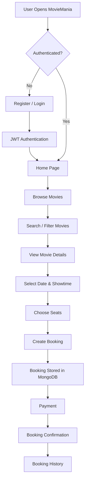
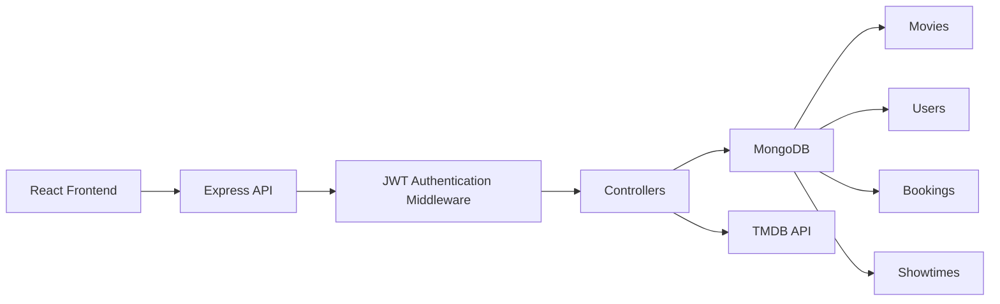
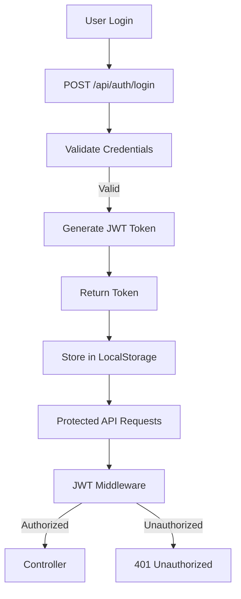
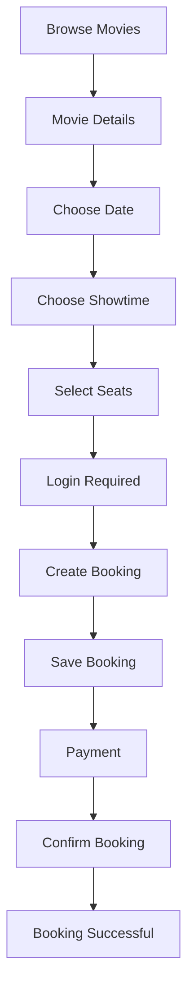
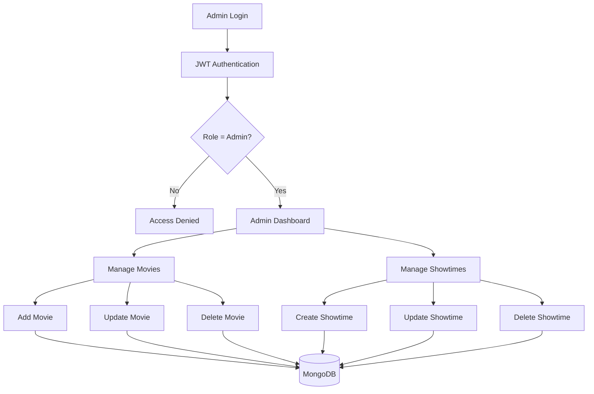
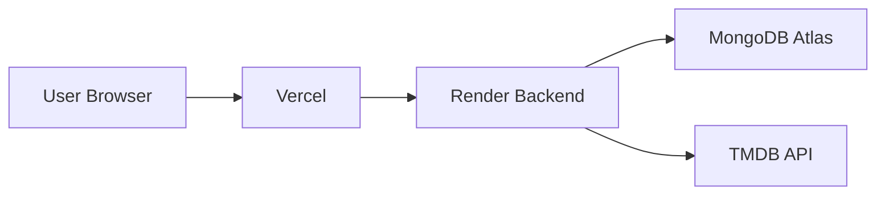

## 📊 System Workflow




## 🏗 Backend Architecture



## 🔐 Authentication Flow




## 🎬 Movie Booking Workflow



## 👨‍💼 Admin Workflow



## 📂 Project Structure

```text
MovieMania
│
├── backend
│   ├── config
│   ├── controllers
│   ├── middleware
│   ├── models
│   ├── routes
│   ├── server.js
│   └── package.json
│
├── public
│
├── src
│   ├── assets
│   ├── components
│   ├── contexts
│   ├── hooks
│   ├── pages
│   ├── utils
│   ├── App.jsx
│   └── main.jsx
│
├── .env
├── package.json
└── README.md
```


## ☁️ Deployment Architecture




